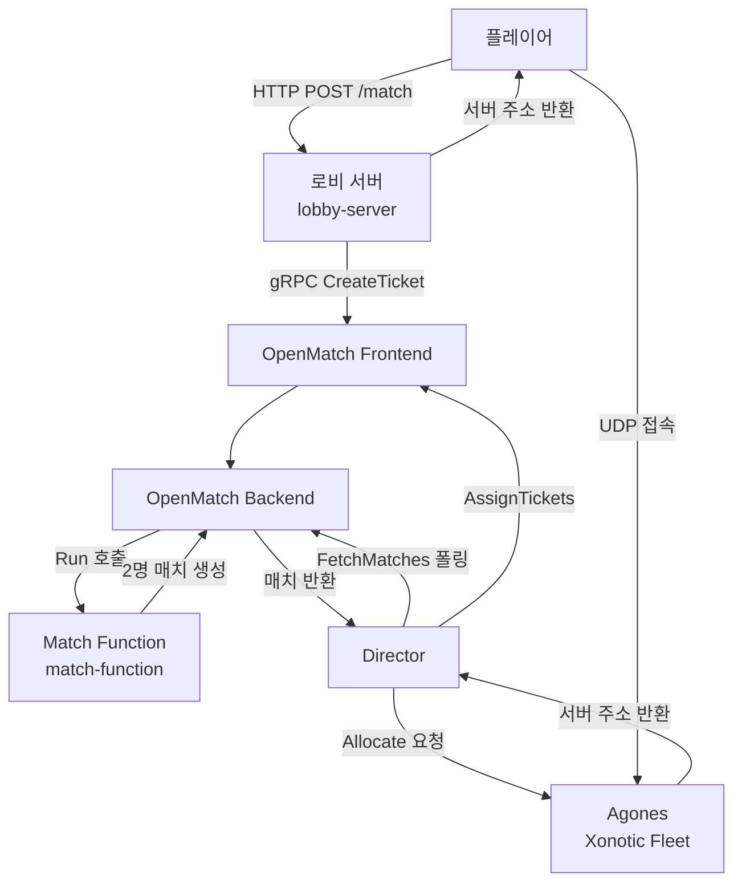

# Agones + OpenMatch Practice

Quilkin, Agones, OpenMatch를 활용한 게임 데디케이티드 서버 및 매치메이킹 서버 구축 프로젝트입니다.

> 🤖 이 프로젝트는 Claude (Anthropic)의 도움을 받아 구축되었습니다.

## 전체 아키텍처




## 컴포넌트 설명

### lobby-server
플레이어의 매칭 요청을 처리하는 HTTP 서버입니다.
- `POST /match` — 매칭 요청 (매칭 완료될 때까지 폴링, 최대 30초)
- `GET /ticket/{id}` — 티켓 상태 조회
- `DELETE /cancel/{id}` — 매칭 취소
- 티켓 자동 만료 (30초)

### match-function
OpenMatch가 호출하는 매칭 로직 서버입니다.
- `mode:deathmatch` 태그가 있는 티켓을 2명씩 묶어서 매치 생성

### director
OpenMatch Backend를 주기적으로 폴링하여 완성된 매치를 처리합니다.
- 5초마다 매치 확인
- 매치 완료 시 Agones에 GameServer Allocate 요청
- 플레이어 티켓에 서버 주소 배정

### k8s
Kubernetes 배포 yaml 파일 모음입니다.
- `xonotic-fleet.yaml` — Xonotic GameServer Fleet (3개)
- `match-function.yaml` — Match Function Deployment & Service
- `evaluator.yaml` — OpenMatch Default Evaluator

## 로컬 개발 환경

### 사전 요구사항
- WSL2 (Ubuntu)
- Docker
- minikube
- kubectl
- Helm
- Go 1.22+

### 클러스터 시작
```bash
minikube start --driver=docker --cpus=2 --memory=4096 \
  --ports=7000-7010:7000-7010/udp \
  --kubernetes-version=v1.29.0
```

### Agones 설치
```bash
kubectl apply --server-side -f \
  https://raw.githubusercontent.com/googleforgames/agones/release-1.44.0/install/yaml/install.yaml
```

### OpenMatch 설치
```bash
helm repo add open-match https://open-match.dev/chart/stable
helm install open-match open-match/open-match \
  --namespace open-match \
  --create-namespace \
  --set redis.image.registry=docker.io \
  --set redis.image.repository=redis \
  --set redis.image.tag=7.2 \
  --set redis.metrics.enabled=false

kubectl create configmap open-match-configmap-override \
  --namespace open-match \
  --from-literal=matchmaker_config_override.yaml="api:
  evaluator:
    hostname: open-match-evaluator
    grpcport: 50508
    httpport: 51508"
```

### Match Function 빌드 & 배포
```bash
cd match-function
docker build -t match-function:v2 .
minikube image load match-function:v2
kubectl apply -f ../k8s/match-function.yaml
kubectl apply -f ../k8s/evaluator.yaml
```

### Xonotic Fleet 배포
```bash
kubectl apply -f k8s/xonotic-fleet.yaml
```

### 실행
```bash
# 포트포워딩
kubectl port-forward -n open-match svc/open-match-frontend 50504:50504 &
kubectl port-forward -n open-match svc/open-match-backend 50505:50505 &
kubectl port-forward -n open-match svc/open-match-query 50503:50503 &

# 로비 서버
cd lobby-server && go run main.go &

# Director
cd director && go run main.go &
```

### 매칭 테스트
```bash
# 터미널 2개에서 동시에 실행
curl -X POST http://localhost:8080/match
curl -X POST http://localhost:8080/match
```

## 기술 스택
- [Agones](https://agones.dev) — Kubernetes 기반 게임 서버 관리
- [OpenMatch](https://open-match.dev) — 매치메이킹 프레임워크
- [Xonotic](https://xonotic.org) — 오픈소스 FPS 게임 (데디 서버 예제)
- [minikube](https://minikube.sigs.k8s.io) — 로컬 Kubernetes 클러스터
- Go 1.22

## 참고
- [Agones 공식 문서](https://agones.dev/site/docs/)
- [OpenMatch 공식 문서](https://open-match.dev/site/docs/)
